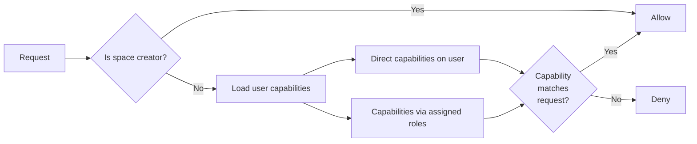

# Access Control

rEEEductio uses a **capability-based** permission system. Instead of a fixed set of admin/member roles, you define exactly what each user or bot is allowed to do — and those permissions are enforced cryptographically, not just checked at the API layer.

## Key concepts

### Space creator

The creator of a space (the entity whose Ed25519 public key is encoded in the space ID) has implicit full access to everything in the space. You don't need to grant yourself permissions — you're the root of trust.

### Users

Every human participant in a space is identified by their **user ID** (`U...`). Users authenticate with an Ed25519 private key and can be granted permissions directly or through roles.

### Roles

A **role** is a named collection of capabilities (e.g. `"member"`, `"moderator"`, `"viewer"`). You define roles yourself — there are no built-in role names. Once a role exists, you assign it to users and attach capabilities to it.

### Capabilities

A **capability** is a single permission: one operation on one resource path. Every capability has:

| Field | Description |
|-------|-------------|
| `op` | What the holder can do: `read`, `create`, `modify`, `delete`, or `write` |
| `path` | Which resource it applies to (supports wildcards) |
| `must_be_owner` | Optional: restricts to the holder's own resources only |

**Operations:**
- `read` — read-only
- `create` — write, only if the object does not yet exist
- `modify` — write, only if the object already exists
- `delete` — delete an existing object
- `write` — full write access (implies create, modify, delete)

**Path wildcards:**
- `{any}` — matches exactly one path segment (e.g. `topics/{any}` matches `topics/general`)
- `{...}` — matches any number of segments at any depth
- `{self}` — matches the authenticated user's own ID (useful for "each user can only write their own profile")

### Tool accounts

**Tools** are bot or service accounts. They authenticate just like users but have no ambient authority — every operation must be covered by an explicit capability. This makes them safe to use for automation without risking accidental privilege escalation.

---

## How authorization works



All authorization state (users, roles, capabilities) is stored in the space's **State** store under `auth/`, and every entry must carry a valid cryptographic signature. The server verifies the chain of trust before accepting any change.

---

## Adding users to a space

### Direct addition (admin)

If you have full access to the space, you can add a user directly by their user ID:

```python
# Python SDK / CLI
space.add_user(user_id='U...')
space.create_role('member')
space.assign_role_to_user(user_id='U...', role_name='member')
```

### Invitation links (self-registration)

Generate a one-time invitation token that lets a new user add themselves:

```python
# Creator generates invitation
invite = space.create_invitation()
# Share invite.private_key with the invitee out-of-band

# Invitee uses the invitation to join
space.accept_invitation(invite_private_key=..., new_user_id='U...')
```

The invitation is a scoped tool keypair with only the capability to create one user entry. After use, it's effectively expired (the user entry already exists, so `create` would be rejected again).

---

## Defining roles and capabilities

```python
# Create a role
space.create_role('moderator')

# Grant capabilities to the role
space.grant_capability_to_role(
    role_name='moderator',
    cap_id='read-all-topics',
    capability={'op': 'read', 'path': 'topics/{any}'},
)
space.grant_capability_to_role(
    role_name='moderator',
    cap_id='delete-any-message',
    capability={'op': 'delete', 'path': 'topics/{any}/messages/{any}'},
)

# Assign role to a user
space.assign_role_to_user(user_id='U...', role_name='moderator')
```

---

## Example: read-only guest role

```python
# Create a viewer role
space.create_role('viewer')

# Let viewers read all topics
space.grant_capability_to_role(
    role_name='viewer',
    cap_id='read-topics',
    capability={'op': 'read', 'path': 'topics/{any}'},
)

# Invite a guest
invite = space.create_invitation()
# ... share invite key with guest ...
# When they join, assign them the viewer role
space.assign_role_to_user(user_id='U...', role_name='viewer')
```

---

## Example: user-private data

The `{self}` wildcard lets you give each user write access to *only* their own data:

```python
space.grant_capability_to_role(
    role_name='member',
    cap_id='own-profile',
    capability={'op': 'write', 'path': 'state/profiles/{self}'},
)
```

A user with this capability can write to `state/profiles/{their_own_id}` but not to any other profile path.

---

## State paths used by the authorization system

All auth state lives under the `auth/` prefix and follows this layout:

```
auth/
├── users/{user_id}                     ← user entry
│   ├── roles/{role_name}               ← role assignment
│   └── rights/{cap_id}                 ← direct capability
├── roles/{role_name}                   ← role definition
│   └── rights/{cap_id}                 ← role's capability
└── tools/{tool_id}                     ← tool entry
    └── rights/{cap_id}                 ← tool's capability
```

You generally don't need to interact with these paths directly — the SDK methods handle it. But understanding the layout helps when debugging permissions or building advanced tooling.

## Related concepts

- [Spaces](spaces.md) — access control is per-space
- [State & Data](state-and-data.md) — auth state is stored in the space's State store
- [Topics & Messages](topics-and-messages.md) — topic read/write is controlled by capabilities
