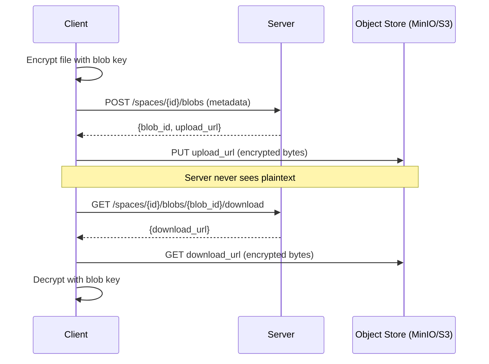

# Blobs

**Blobs** are rEEEductio's encrypted file storage. Use them whenever you need to store binary data that's too large for a message payload — images, documents, audio files, backups, and so on.

## How blobs work

Blob storage is content-addressed: the blob's ID is derived from its content. Upload the same bytes twice, and you get the same blob ID back.

Encryption happens entirely client-side. The SDK encrypts the file before uploading, and decrypts after downloading. The server and object store (MinIO by default) only ever see ciphertext.



## Blob IDs

Each blob gets a `B`-prefixed content-addressed ID (e.g. `Babc123...`). This ID is stable: the same plaintext content always produces the same blob ID, regardless of when or how many times you upload it.

## Uploading a blob

=== "Python"

    ```python
    # Read a file and upload it
    with open('photo.jpg', 'rb') as f:
        image_data = f.read()

    result = space.upload_encrypted_blob(
        data=image_data,
        content_type='image/jpeg',
    )
    print(result.blob_id)   # B...

    # Save the blob ID in a message so others can find it
    space.post_encrypted_message(
        topic_id='photos',
        message_type='chat.image',
        data=result.blob_id.encode(),
    )
    ```

=== "TypeScript"

    ```typescript
    import { stringToBytes } from 'reeeductio';

    // Read a file (e.g. from a browser <input type="file">)
    const arrayBuffer = await file.arrayBuffer();
    const data = new Uint8Array(arrayBuffer);

    const result = await space.encryptAndUploadBlob(data, file.type);
    console.log(result.blob_id);   // B...

    // Post the blob ID as a message so others can find it
    await space.postEncryptedMessage(
      'photos',
      'chat.image',
      stringToBytes(result.blob_id),
    );
    ```

## Downloading a blob

=== "Python"

    ```python
    # Download and decrypt
    data = space.download_and_decrypt_blob(blob_id='B...')
    with open('downloaded.jpg', 'wb') as f:
        f.write(data)
    ```

=== "TypeScript"

    ```typescript
    const data = await space.downloadAndDecryptBlob('B...');
    // data is a Uint8Array containing the original file bytes
    ```

## Deleting a blob

=== "Python"

    ```python
    space.delete_blob(blob_id='B...')
    ```

=== "TypeScript"

    ```typescript
    await space.deleteBlob('B...');
    ```

!!! warning "Deletion is permanent"
    Once a blob is deleted, it cannot be recovered. If any messages reference the blob ID, those references will be broken.

## Encryption details

Blob encryption uses the same HKDF key hierarchy as the rest of the space. A blob-specific key is derived from `symmetricRoot`. You do not need to manage blob keys manually — the SDK handles it.

## Linking blobs and messages

The convention for sharing a blob in a conversation is to post a message whose `data` payload is the blob ID. Recipients see the message, extract the blob ID, and download and decrypt the blob separately.

This keeps messages small while allowing arbitrarily large file attachments.

## Related concepts

- [Topics & Messages](topics-and-messages.md) — post blob IDs as message payloads
- [Spaces](spaces.md) — blobs are scoped to a single space
- [State & Data](state-and-data.md) — for small structured values, not large files
