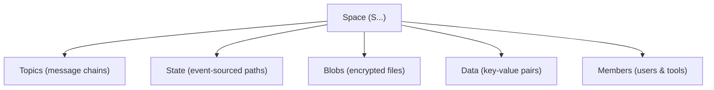
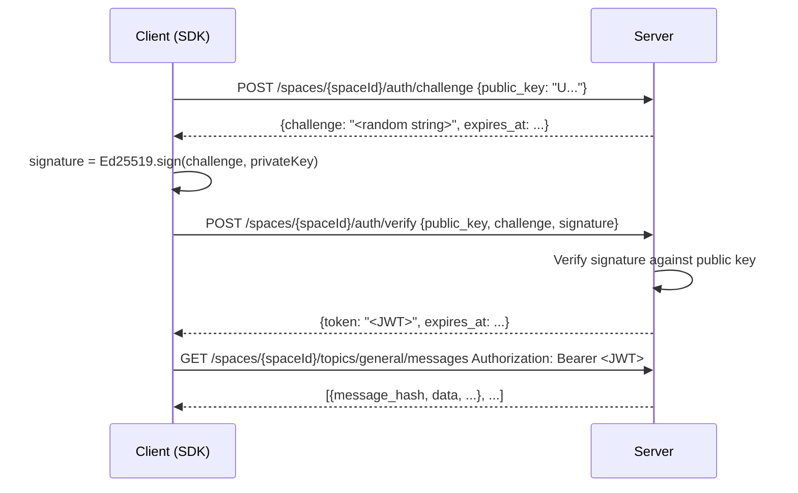

# Spaces

A **space** is the top-level container in rEEEductio. Think of it as a secure, encrypted workspace — like a group chat room, a shared project folder, or a per-user data silo, depending on how you use it.

Everything in rEEEductio lives inside a space: messages, files, structured state, and key-value data. Access to a space is controlled by cryptographic keys, not passwords or API tokens.

## What a space contains



| Component | What it is | Typical use |
|-----------|-----------|-------------|
| **Topics** | Ordered chains of encrypted messages | Chat, event streams, audit logs |
| **State** | Named paths with version history | User profiles, config, access control |
| **Blobs** | Content-addressed encrypted files | Attachments, images, backups |
| **Data** | Lightweight signed key-value pairs | Ephemeral metadata, flags |
| **Members** | Users and tool accounts with roles | Multi-user collaboration |

## Space identity

Every space has two complementary keys:

**Ed25519 key pair** — the *signing* identity. The public key is encoded into the space ID and user ID. The private key proves who you are to the server.

**Symmetric root** — a 32-byte random secret shared among the space's members. The SDK uses it with HKDF to derive separate encryption keys for messages, state, and blobs, without any single key doing double-duty.

```mermaid
graph TD
    SR["Symmetric Root (32 random bytes)"]
    SR -->|HKDF| MK["message_key (per space)"]
    SR -->|HKDF| DK["data_key (per space)"]
    MK -->|HKDF| TK1["topic_key['general']"]
    MK -->|HKDF| TK2["topic_key['alerts']"]
    MK -->|HKDF| SK["state_key (reserved topic 'state')"]
    TK1 -->|AES-GCM| E1[Encrypted messages in 'general']
    TK2 -->|AES-GCM| E2[Encrypted messages in 'alerts']
    SK  -->|AES-GCM| E3[Encrypted state entries]
    DK  -->|AES-GCM| E4[Encrypted data entries]
```



Each topic has its own key, derived fresh each time from `message_key`. Sharing a topic key with someone does not expose any other topic's data.

Neither the key pair nor the symmetric root alone is enough. You need both to read and write data in a space.

## Authentication flow

Every API request is authenticated with a short-lived JWT token. The token is obtained through a challenge-response exchange using your Ed25519 private key — no passwords involved.



The SDK handles this automatically — you never need to call the auth endpoints directly.

## Space and user IDs

Both IDs are derived from the same Ed25519 public key, just with a different type prefix:

| ID | Starts with | Purpose |
|----|-------------|---------|
| Space ID | `S` | Identifies the space to the server |
| User ID | `U` | Identifies you as a member of the space |

Both are 44-character URL-safe base64 strings.

## The space creator

When you create a new space, your key pair becomes the first and only member. You are the **space creator** — the implicit admin with full rights to invite others and grant permissions.

With `auto_create_spaces: true` in the server config (default for local dev), the space is created automatically the first time you connect using a new space ID. You don't need any separate "create space" API call.

## Spaces and servers

A space lives on a single server. The server stores encrypted ciphertext and enforces access control (who can read/write which parts of the space), but it never sees plaintext — encryption and decryption happen exclusively on the client.

You can think of the server as a trusted courier: it delivers messages reliably and in order, but it cannot read them.

## When to use multiple spaces

One space per logical boundary of trust. Good rules of thumb:

- **One space per user** — each user's private data in its own space that only they can access.
- **One space per team or project** — shared among the team; each member has the `symmetric_root`.
- **One space per integration** — bot accounts or third-party tools get their own space (or a scoped tool account inside an existing space).

Spaces are cheap to create. Don't try to share one space across unrelated trust domains.

## Creating a space

=== "Python"

    ```python
    import os
    from reeeductio.crypto import generate_keypair, to_space_id, to_user_id

    private_key, public_key = generate_keypair()
    symmetric_root = os.urandom(32)

    space_id = to_space_id(public_key)   # starts with 'S'
    user_id  = to_user_id(public_key)    # starts with 'U'
    ```

=== "TypeScript"

    ```typescript
    import { generateKeyPair, toSpaceId, toUserId } from 'reeeductio';

    const keyPair = await generateKeyPair();
    const symmetricRoot = crypto.getRandomValues(new Uint8Array(32));

    const spaceId = toSpaceId(keyPair.publicKey);   // starts with 'S'
    const userId  = toUserId(keyPair.publicKey);    // starts with 'U'
    ```

## Related concepts

- [Topics & Messages](topics-and-messages.md) — how ordered message chains work inside a space
- [Access Control](access-control.md) — how to invite users and grant roles
- [State & Data](state-and-data.md) — structured storage beyond messages
