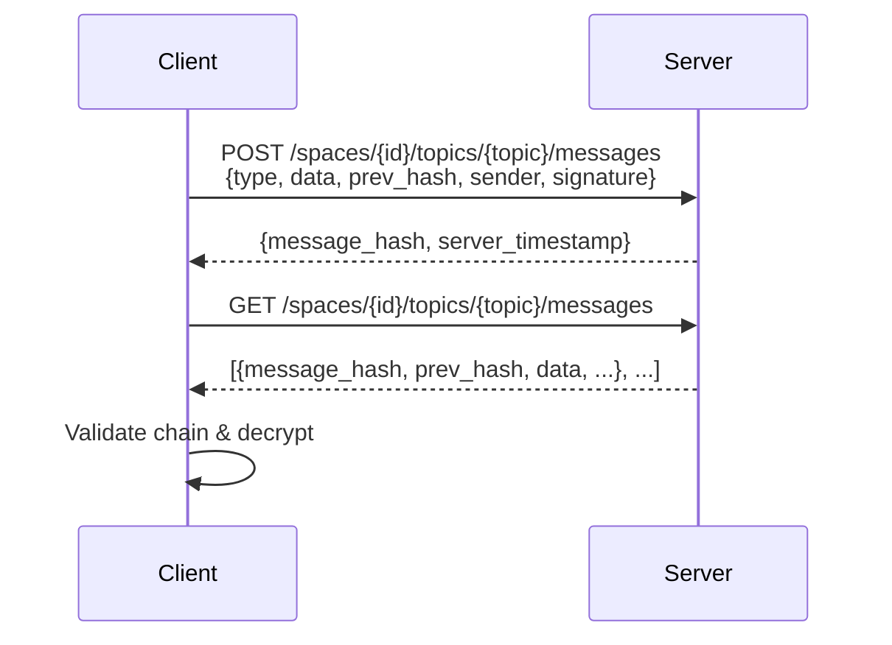

# Topics & Messages

**Topics** are named, ordered channels within a space. Every message belongs to exactly one topic. You can have as many topics as you like — `"general"`, `"alerts"`, `"notifications"` — and each maintains its own independent message chain.

Topic IDs must be 2–64 characters of lowercase letters, digits, hyphens, or underscores, starting and ending with an alphanumeric character (e.g. `general`, `user-notes`, `audit_log`).

## The message chain

Messages in a topic form a **hash chain**: each message records the hash of the previous one. This gives you a tamper-evident, append-only log. If any message is altered after the fact, every subsequent hash would be wrong, and the SDK detects it.



Each message on the wire looks like:

| Field | Description |
|-------|-------------|
| `message_hash` | `M`-prefixed hash of this message's content |
| `prev_hash` | Hash of the previous message (or `null` for the first) |
| `type` | Application-defined string, e.g. `"chat.text"`, `"file.upload"` |
| `data` | Base64-encoded AES-GCM ciphertext |
| `sender` | User ID of the author |
| `signature` | Ed25519 signature over the message content |
| `server_timestamp` | When the server received the message (milliseconds UTC) |

## Encryption

All message data is encrypted **before** it leaves the client. The server stores only ciphertext.

Key derivation follows this tree:

```
symmetricRoot
└── message_key  (HKDF "message key | {spaceId}")
    └── topic_key  (HKDF "topic key | {topicId}")
```

Each topic has its own derived key, so one topic's messages cannot be decrypted with another topic's key.

## Sending a message

=== "Python"

    ```python
    from reeeductio import Space

    space = Space(space_id=..., member_id=..., private_key=..., symmetric_root=...)

    result = space.post_encrypted_message(
        topic_id='general',
        message_type='chat.text',
        data=b'Hello, encrypted world!',
    )
    print(result.message_hash)   # M...
    ```

=== "TypeScript"

    ```typescript
    import { Space, stringToBytes } from 'reeeductio';

    const space = new Space({ spaceId, keyPair, symmetricRoot, baseUrl });

    const result = await space.postEncryptedMessage(
      'general',
      'chat.text',
      stringToBytes('Hello, encrypted world!'),
    );
    console.log(result.message_hash);  // M...
    ```

## Reading messages

=== "Python"

    ```python
    msgs = space.get_messages('general')
    for msg in msgs.messages:
        plaintext = space.decrypt_message_data(msg, 'general')
        print(plaintext.decode())
    ```

=== "TypeScript"

    ```typescript
    const { messages } = await space.getMessages('general');
    for (const msg of messages) {
      const plaintext = space.decryptMessageData(msg, 'general');
      console.log(new TextDecoder().decode(plaintext));
    }
    ```

## Message ordering

Messages are returned in the order the server received them (by `server_timestamp`). The SDK's chain validation independently verifies that the `prev_hash` links are correct — so you always get a consistent, ordered, tamper-evident log regardless of whether you trust the server's timestamp.

You can query by time range:

=== "Python"

    ```python
    import time

    one_hour_ago = int(time.time() * 1000) - 3_600_000
    msgs = space.get_messages('general', from_ts=one_hour_ago)
    ```

=== "TypeScript"

    ```typescript
    const oneHourAgo = Date.now() - 3_600_000;
    const { messages } = await space.getMessages('general', { from: oneHourAgo });
    ```

## Message types

The `type` field is a free-form string you define for your application. A simple convention is `"category.action"`:

| Type | Meaning |
|------|---------|
| `chat.text` | Plain text chat message |
| `chat.image` | Image attachment (data holds a blob ID) |
| `file.upload` | File was uploaded |
| `event.join` | User joined |

The server doesn't interpret or filter by type — that's entirely up to your application.

## Real-time updates (WebSocket)

You can subscribe to a topic's live stream over WebSocket:

=== "Python"

    ```python
    async with space.subscribe('general') as stream:
        async for msg in stream:
            plaintext = space.decrypt_message_data(msg, 'general')
            print(plaintext.decode())
    ```

=== "TypeScript"

    ```typescript
    // Coming soon — see the reference for the low-level WebSocket API
    ```

## Related concepts

- [Spaces](spaces.md) — the container that holds topics
- [Access Control](access-control.md) — who can post to a topic
- [Blobs](blobs.md) — for large file payloads referenced from messages
