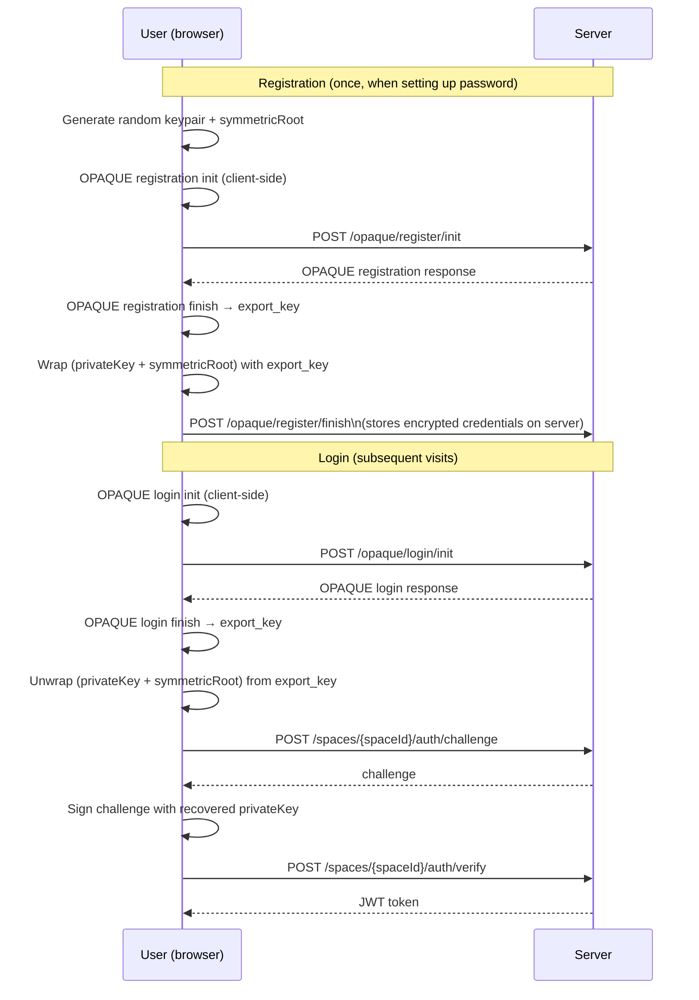

# Password Login (OPAQUE)

By default, rEEEductio uses public-key authentication — you authenticate by signing a challenge with your Ed25519 private key. There are no passwords.

OPAQUE is an **optional** add-on that lets users protect their credentials with a password. It does not replace the keypair — instead, it lets you recover your private key and symmetric root from a password, so you don't have to store them in plaintext.

!!! note "Optional feature"
    OPAQUE requires one-time setup by the space admin. If you just want to get started, skip this page — the default keypair authentication works fine.

## What OPAQUE is (and isn't)

OPAQUE is an *asymmetric Password Authenticated Key Exchange* (aPAKE) protocol. In rEEEductio, it is used exclusively for **credential recovery**, not for access control.

- Your Ed25519 keypair is still randomly generated, not derived from your password.
- Your password is never sent to the server, not even hashed.
- If you change your password, your public key and space ID stay the same.
- OPAQUE lets you reconstruct your `privateKey` and `symmetricRoot` from a password, which you can then use for the normal challenge-response login.

## OPAQUE login flow



The key insight: the server never sees your password. It only sees OPAQUE protocol messages from which the password cannot be recovered.

## Setup: enable OPAQUE for a space

OPAQUE requires one-time admin setup before any user can register. The space admin runs:

=== "Python"

    ```python
    from reeeductio import Space
    from reeeductio.opaque import enable_opaque

    space = Space(space_id=..., member_id=..., private_key=..., symmetric_root=...)
    enable_opaque(space)
    ```

=== "TypeScript"

    ```typescript
    import { Space } from 'reeeductio';

    const space = new Space({ spaceId, keyPair, symmetricRoot, baseUrl });
    await space.enableOpaque();
    ```

This generates an OPAQUE server setup and stores it in the space's data store. It only needs to be done once.

## Registering a password

Once OPAQUE is enabled, any member can register a password:

=== "Python"

    ```python
    from reeeductio.opaque import perform_opaque_registration

    perform_opaque_registration(
        space=space,
        username='alice',
        password='my-secure-password',
    )
    ```

=== "TypeScript"

    ```typescript
    await space.performOpaqueRegistration('alice', 'my-secure-password');
    ```

## Logging in with a password

Once registered, a user can recover their credentials and log in using only their password and username:

=== "Python"

    ```python
    from reeeductio.opaque import login_with_opaque

    space = login_with_opaque(
        base_url='http://localhost:8000',
        space_id='S...',
        username='alice',
        password='my-secure-password',
    )
    # space is now authenticated and ready to use
    ```

=== "TypeScript"

    ```typescript
    import { loginWithOpaque } from 'reeeductio';

    const space = await loginWithOpaque({
      baseUrl: 'http://localhost:8000',
      spaceId: 'S...',
      username: 'alice',
      password: 'my-secure-password',
    });
    // space is now authenticated and ready to use
    ```

## Security properties

| Property | Guarantee |
|----------|-----------|
| Password never leaves the client | ✅ The OPAQUE protocol is designed so the server cannot learn your password |
| Server compromise | ✅ An attacker who steals the server database cannot recover passwords offline (no password hash to crack) |
| Credential recovery | ✅ You can recover `privateKey` and `symmetricRoot` from your password alone |
| Rate limiting | ✅ The server enforces rate limits on OPAQUE login attempts |
| Password change | ✅ Re-registers with new password; public key and space ID unchanged |

!!! warning "Not a backup for lost credentials"
    OPAQUE lets you recover credentials *if you registered a password before losing them*. If you never registered a password and lose your private key, the data is unrecoverable — by design.

## Related

- [Spaces](../concepts/spaces.md) — how authentication normally works (challenge-response)
- [Tool Accounts](tool-accounts.md) — for bot/service accounts that don't need password login
